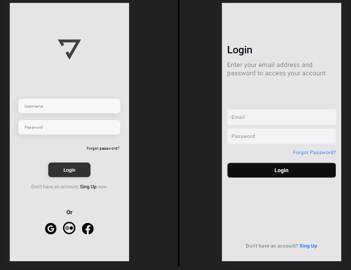

# Yoga- Interface

> Yoga's app Interface
### Project steps

The project is still under development. Below are the current definitions of performed tasks and upcoming updates:

- [x] Create HTML
- [x] Create CSS
- [ ] Layout Update
- [ ] Add Javascript

## 🤝 Colaboradores

We thank the following people for this project:

<table>
  <tr>
    <td align="center">
      <a href="#">
         
        
          <a href="https://www.linkedin.com/in/yurimayk/" target="_blank"><b>Yuri Medeiros</b></a>
        
      </a>
    </td>
    <td align="center">
      <a href="#">
         
        
          <a href="https://www.linkedin.com/in/rodolfomori/" target="_blank"><b>Rodolfo Mori</b></a>
        
      </a>
    </td>
</table>

[⬆ Voltar ao topo](#nome-do-projeto) 
